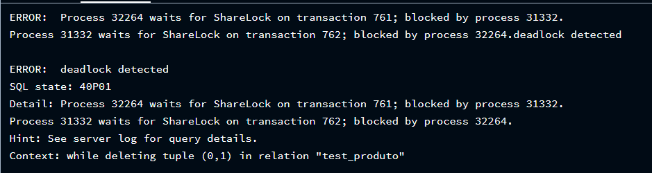

Mário Balen (1136196)

Pablo Sarturi (1136331)

# Transactions

## 1.1
* Na T1, o primeiro `SELECT` não possuiu o que foi inserido na sessão T2, porém, após o `COMMIT` realizado nela, a T1 recebeu o registro com a chave 3. E sim, o isolamento foi aplicado pois na T2 sem a utilização do comando `COMMIT`, a inserção ficou isolada apenas nela.

## 1.2
* A saída da T1 ficou no aguardo da liberação do LOCK da T2, pois ambas tentaram inserir o mesmo registro com PK 6 e a T2 ficou com o LOCK pois "venceu" a race condition.
E então, para manter a chave 6 da T1 no banco de dados, é preciso de um `ROLLBACK` na T2, para liberar o recurso, e permitir que a T1 realize a inserção, e após isso, fazer o `COMMIT` nela para salvar no banco. Por outro lado, para a T2 seria apenas necessário colocar um `COMMIT`, ocasionando um erro de chave já duplicada na T1 quando ela fosse tentar inserir.

## 1.3
* Na T1, foi inserido a chave 7 no banco de dados com um `COMMIT`, logo após, TODAS as chaves foram deletadas, sendo assim "ocupadas" pela T1 (ficando com o lock dos registros). Logo após a execução destes comandos, a T2 também quer apagar, porém, todas as chaves estão ocupadas pela T1, ou seja, ela fica aguardando uma resolução da T1. Ao fazer o  `ROLLBACK` depois do `DELETE` da T1, os dados irão ser restaurados, assim liberando o LOCK da T1 para ai liberar a execução do `DELETE` da T2.

## 1.4

* O deadlock significa que o dado que uma transação está querendo acessar, já está bloqueado por outra, e essa outra transação depende do lock desta transação também, fazendo com que seja impossível resolver esse conflito automaticamente pelas transações, visto que ambas precisam da liberação do LOCK, mas nenhuma consegue prosseguir. No exemplo acima, cada sessão inseriu um registro e obteve um LOCK exclusivo sobre ele, em seguida, cada uma delas tentou deletar o registro da outra, nesse caso vai mostrar um erro pois cada uma que inseriu possui o LOCK do seu próprio registro.

## 1.5
### a)
* Sim, o segundo terminal, pois o `FOR UPDATE` realizado no primeiro causa um lock nos registros retornados pelo `SELECT`, proibindo seu acesso por outras transações até que seja feito o `COMMIT` ou `ROLLBACK`.

### b)
* Sim, libera.

### c)
* Sim, ocorreu o erro "Não foi possível obter bloqueio na linha da relação "table1", pois ao utilizar o comando `NOWAIT`, iremos dizer ao SGBD para jogar um erro caso os registros retornados não possam ser bloqueados imediatamente, que é o que ocorre neste caso, visto que o terminal 1 está com o LOCK.