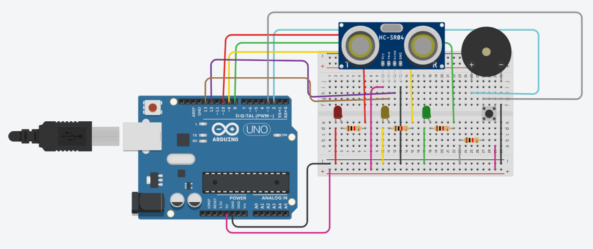
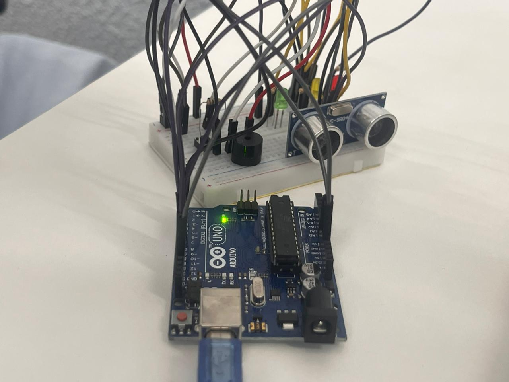
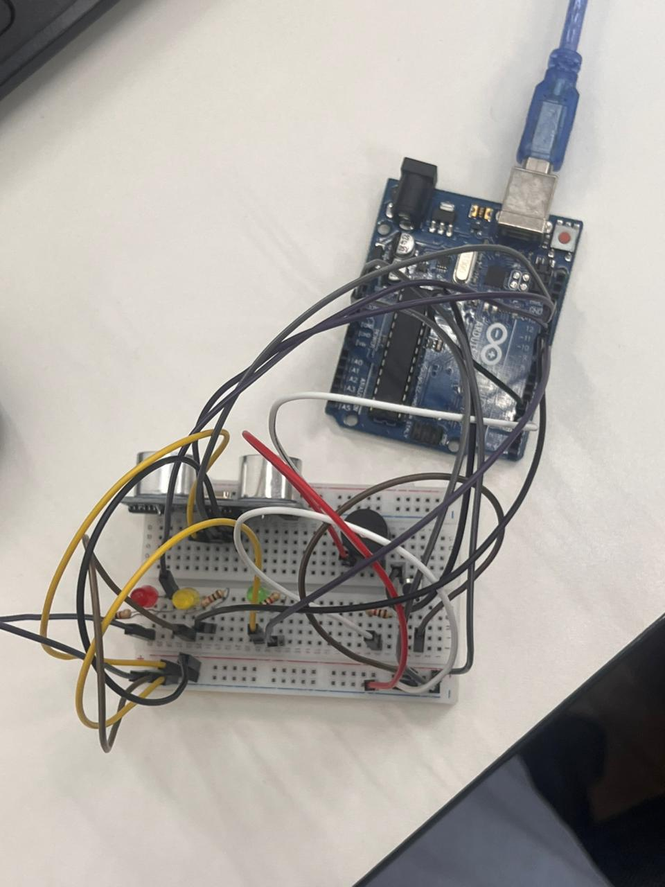
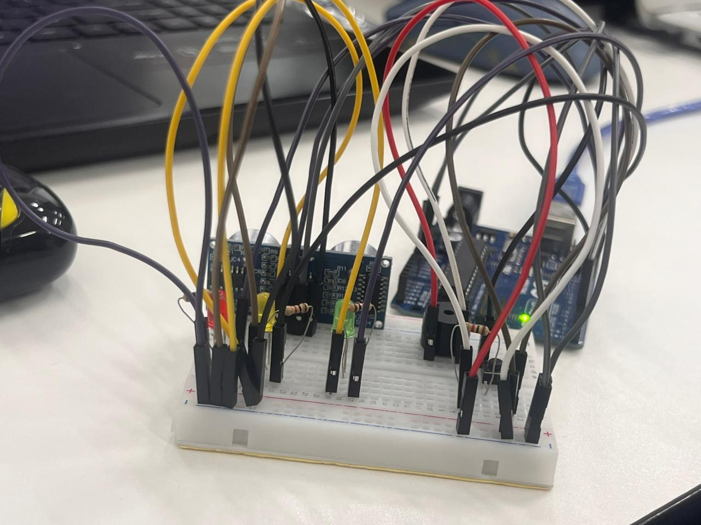
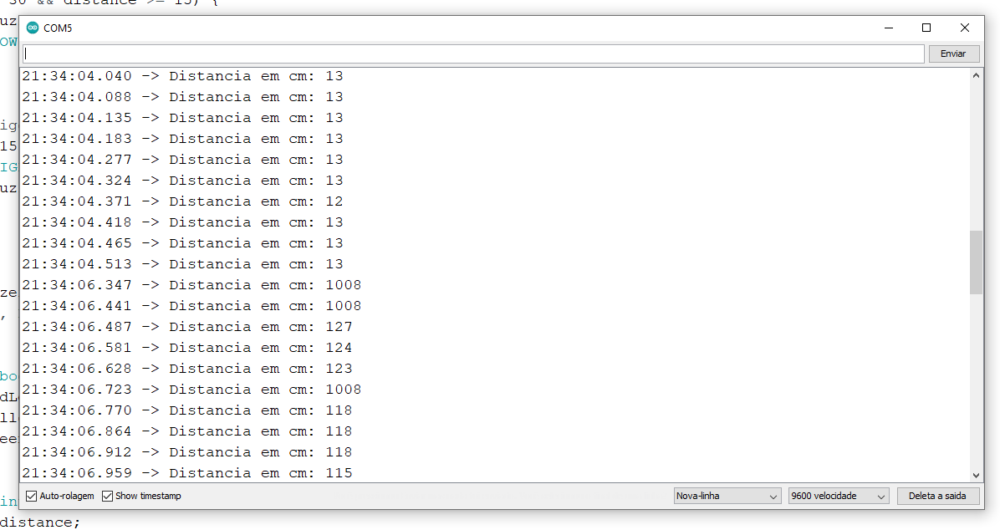

<div style="text-align: right"><i>Hardware Architecture</i></div>
<div style="text-align: right"><i>Prof. Tiago de Avila Mendes</i></div>

# Sistema de Alerta de Proximidade com Controle de LED

* Mário Bernardo Balen (1136196)
* Pablo Henrique Strücker Sarturi (1136331)

## TinkerCad
Abaixo segue o projeto montado dentro da ferramenta TinkerCad.



<div style="page-break-after: always;"></div>

## Código
O circuito utilizou o seguinte código c++.

```c++
#define triggerPinUltra 13
#define echoPinUltra 12
#define redLed 10
#define greenLed 8
#define yellowLed 9
#define button 3
#define buzzer 2

bool systemActive = false;
bool lastButtonState = HIGH;

void setup() {
  delay(500);
  Serial.begin(9600);
  pinMode(redLed, OUTPUT);
  pinMode(greenLed, OUTPUT);
  pinMode(yellowLed, OUTPUT);

  pinMode(triggerPinUltra, OUTPUT);
  pinMode(echoPinUltra, INPUT);

  pinMode(buzzer, OUTPUT);

  pinMode(button, INPUT);
}

void loop() {
  bool buttonState = digitalRead(button);

  //verifica o ultimo estado do botao, para persistir
  if(buttonState == LOW && lastButtonState == HIGH){
    systemActive = !systemActive;
  }

  lastButtonState = buttonState;

  //se o botao esta LOW, fica em standby
  if(!systemActive){
    controlLeds(LOW, LOW, LOW);
    return;
  }

  //pega a distancia do ultrassonico
  long distance = getDistance(triggerPinUltra, echoPinUltra);

  lastButtonState = buttonState;
  
  //distancia media
  if (distance <= 30 && distance >= 15) {
    analogWrite(buzzer, 0);
    controlLeds(LOW, HIGH, LOW);
    return;
  }

  //distancia perigo
  if (distance < 15) {
    controlLeds(HIGH, LOW, LOW);
    analogWrite(buzzer, 255);
    return;
  }

  //distancia ok
  analogWrite(buzzer, 0);
  controlLeds(LOW, LOW, HIGH);
}

void controlLeds(bool red, bool yellow, bool green){
  digitalWrite(redLed, red);
  digitalWrite(yellowLed, yellow);
  digitalWrite(greenLed, green);
}

long getDistance(int triggerPin, int echoPin) {
  long duration, distance;
  digitalWrite(triggerPin, LOW);
  delayMicroseconds(2);
  digitalWrite(triggerPin, HIGH);
  delayMicroseconds(10);
  digitalWrite(triggerPin, LOW);
  duration = pulseIn(echoPin, HIGH);
  distance = (duration / 2) / 29.1;
  Serial.print("Distancia em cm: ");
  Serial.println(distance);
  delay(50);

  return distance;
}
```

<div style="page-break-after: always;"></div>

## Projeto Pronto
Fotos do projeto montado e do serial marcando a distância pelo sensor ultrassônico.







