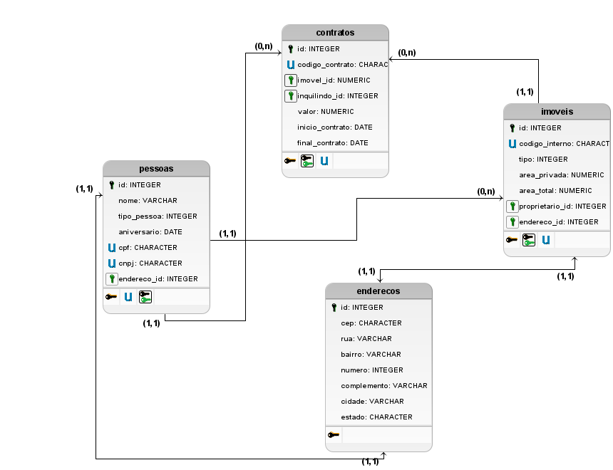

# Sistema de Gerenciamento de Aluguéis
* **Pablo H.S. Sarturi**
* **RA 1136331**

## O que é
O seguinte sistema visa auxiliar o **controle de aluguéis** de uma corretora de imóveis.
* O sistema possui cadastro de `pessoas` (clientes e proprietários), que podem ser tanto pessoas jurídicas, quanto pessoas físicas.
* Tanto a pessoa, quanto o `imóvel` terão o `endereço` para indicar onde estão localizados (ou onde a pessoa física reside).
* A tabela de `contratos`, terá as informações do inquilino e do imóvel alugado.

## Modelo ER


<div style = "display:block; clear:both; page-break-after:always;"></div>

## Scripts de Criação

```SQL
CREATE TYPE enum_tipo_pessoa AS ENUM ('Física', 'Jurídica');
CREATE TYPE enum_tipo_imovel AS ENUM ('Casa', 'Apartamento');

CREATE TABLE enderecos(
    id SERIAL PRIMARY KEY,
    cep CHARACTER(8),
    rua VARCHAR(100),
    bairro VARCHAR(50),
    numero INTEGER,
    complemento VARCHAR(150),
    cidade VARCHAR(100),
    estado CHARACTER(2)
);

CREATE TABLE pessoas(
    id SERIAL PRIMARY KEY,
    nome VARCHAR(150) NOT NULL,
    aniversario DATE,
    tipo_pessoa enum_tipo_pessoa,
    cpf CHARACTER(11),
    cnpj CHARACTER(14),
    endereco_id INTEGER REFERENCES enderecos (id)
);

CREATE TABLE imoveis(
    id SERIAL PRIMARY KEY,
    codigo_interno CHARACTER(8) UNIQUE NOT NULL,
    tipo enum_tipo_imovel,
    area_privada NUMERIC(5,2),
    area_total NUMERIC(5,2),
    proprietario_id INTEGER REFERENCES pessoas (id) NOT NULL
);

CREATE TABLE contratos(
    id SERIAL PRIMARY KEY, 
    codigo_contrato CHARACTER(8) UNIQUE NOT NULL,
    imovel_id INTEGER REFERENCES imoveis(id) NOT NULL,
    inquilino_id INTEGER REFERENCES pessoas(id) NOT NULL,
    valor NUMERIC(8,2),
    inicio_contrato DATE,
    final_contrato DATE
);
```
<div style = "display:block; clear:both; page-break-after:always;"></div>

## Scrips de Adição

```SQL
-- Inserindo dados na tabela enderecos
INSERT INTO enderecos (cep, rua, bairro, numero, complemento, cidade, estado) VALUES 
('12345678', 'Rua das Flores', 'Centro', 100, 'Apt 101', 'São Paulo', 'SP'),
('23456789', 'Av. Paulista', 'Bela Vista', 1500, 'Bloco B', 'São Paulo', 'SP'),
('34567890', 'Rua Verde', 'Jardim', 200, 'Casa', 'Campinas', 'SP'),
('45678901', 'Rua Azul', 'Industrial', 50, NULL, 'Curitiba', 'PR'),
('56789012', 'Av. Brasil', 'Centro', 300, 'Sala 202', 'Rio de Janeiro', 'RJ'),
('67890123', 'Rua da Paz', 'Residencial', 120, NULL, 'Brasília', 'DF'),
('78901234', 'Av. das Nações', 'Comercial', 450, 'Apt 302', 'Porto Alegre', 'RS'),
('89012345', 'Rua 1', 'Centro', 88, 'Conjunto A', 'Belo Horizonte', 'MG'),
('90123456', 'Rua 2', 'Bela Vista', 77, NULL, 'Florianópolis', 'SC'),
('01234567', 'Rua 3', 'Independência', 99, 'Casa B', 'Salvador', 'BA');

-- Inserindo dados na tabela pessoas
INSERT INTO pessoas (nome, aniversario, tipo_pessoa, cpf, cnpj, endereco_id) VALUES 
('João Silva', '1980-05-20', 'Física', '12345678901', NULL, 1),
('Maria Oliveira', '1992-07-15', 'Física', '23456789012', NULL, 2),
('Empresa ABC Ltda', NULL, 'Jurídica', NULL, '11223344556677', 3),
('Carlos Pereira', '1975-02-10', 'Física', '34567890123', NULL, 4),
('Fernanda Souza', '1990-11-22', 'Física', '45678901234', NULL, 5),
('Construtora XYZ S/A', NULL, 'Jurídica', NULL, '22334455667788', 6),
('Ricardo Lima', '1988-09-09', 'Física', '56789012345', NULL, 7),
('Patrícia Fernandes', '1983-12-03', 'Física', '67890123456', NULL, 8),
('Distribuidora JKL Ltda', NULL, 'Jurídica', NULL, '33445566778899', 9),
('Ana Costa', '1995-04-25', 'Física', '78901234567', NULL, 10);

-- Inserindo dados na tabela imoveis
INSERT INTO imoveis (codigo_interno, tipo, area_privada, area_total, proprietario_id) VALUES 
('IMV00001', 'Casa', 150.00, 200.00, 1),
('IMV00002', 'Apartamento', 80.00, 90.00, 2),
('IMV00003', 'Casa', 120.00, 150.00, 3),
('IMV00004', 'Apartamento', 75.00, 85.00, 4),
('IMV00005', 'Casa', 180.00, 220.00, 5),
('IMV00006', 'Apartamento', 95.00, 100.00, 6),
('IMV00007', 'Casa', 200.00, 250.00, 7),
('IMV00008', 'Apartamento', 70.00, 80.00, 8),
('IMV00009', 'Casa', 160.00, 200.00, 9),
('IMV00010', 'Apartamento', 85.00, 95.00, 10);

-- Inserindo dados na tabela contratos
INSERT INTO contratos (codigo_contrato, imovel_id, inquilino_id, valor, inicio_contrato, final_contrato) VALUES 
('CTR00001', 1, 2, 1500.00, '2023-01-01', '2024-01-01'),
('CTR00002', 2, 3, 1200.00, '2023-02-01', '2024-02-01'),
('CTR00003', 3, 4, 1800.00, '2023-03-01', '2025-03-01'),
('CTR00004', 4, 5, 1100.00, '2023-04-01', '2024-04-01'),
('CTR00005', 5, 6, 2200.00, '2023-05-01', '2025-05-01'),
('CTR00006', 6, 7, 1400.00, '2023-06-01', '2027-06-01'),
('CTR00007', 7, 8, 2500.00, '2023-07-01', '2024-07-01'),
('CTR00008', 8, 9, 1300.00, '2023-08-01', '2024-08-01'),
('CTR00009', 9, 10, 2000.00, '2023-09-01', '2025-09-01'),
('CTR00010', 10, 1, 1600.00, '2023-10-01', '2026-10-01');
```

## Scrips de Consulta
```SQL
-- SELECT
SELECT * FROM pessoas;

-- WHERE
-- CONTRATOS QUE AINDA NÃO FORAM ENCERRADOS (data final maior que hoje)
SELECT * FROM contratos WHERE final_contrato > CURRENT_DATE;

-- INNER JOIN
-- MOSTRA O VALOR QUE O INQUILINO PAGA DE ALUGUEL E QUAL O CÓDIGO DO CONTRATO
SELECT c.codigo_contrato, p.nome, c.valor FROM contratos c
INNER JOIN pessoas p
ON c.inquilino_id = p.id;

-- COUNT E GROUPY BY
-- VERIFICA QUANTAS PESSOAS SÃO JURÍDICAS, E QUANTAS SÃO FÍSICAS
SELECT tipo_pessoa, COUNT(tipo_pessoa) as qtd 
FROM pessoas GROUP BY tipo_pessoa;
```